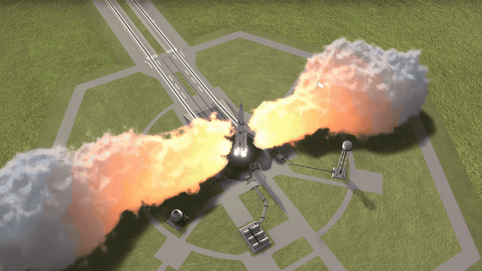

# Volumetric Ground FX

**VGFX · KSP 1.12.5 · Windows / DirectX 11 · MIT**

Volumetric launch-pad steam, dust, water spray, ejecta and ground marks.
Effects respond to engine thrust, height above the surface and the environment.
Visual effects only — no changes to vessel thrust or flight physics.

Formerly **GroundBlastFx**. The installation folder stays the same.


[Installation](#installation) · [Settings](#settings) · [Screenshots](#screenshots) · [Compatibility](#compatibility)

## In game



## What's new in 1.1.0

- More detailed launch-pad steam, with a smoother transition from the trench outlets to the clouds.
- A brief blast when boosters ignite or thrust rises sharply.
- Brightness and blast-strength controls.
- Ground marks can be disabled or cleared from the flight window.

## Installation

1. Close KSP.
2. Extract the release ZIP and copy `GroundBlastFx` into `GameData`.
3. Launch KSP. The VGFX toolbar button opens the settings in flight.

[GitHub releases](https://github.com/warnix91/GroundBlastFx/releases) · [SpaceDock](https://spacedock.info/mod/4615/GroundBlastFx)

No other mods are required. When updating, keep
`GroundBlastFx/PluginData/Settings.cfg` and `LaunchSites_user.cfg`, if present,
to retain your settings and custom launch sites. Install one copy in
`GameData/GroundBlastFx`; do not create a second folder named `VGFX`.

To uninstall, remove `GameData/GroundBlastFx`.

## Settings

Adjust effect density, visible range, brightness and blast strength.
Brightness defaults to **85%** and blast strength to **100%**.
Existing saved settings take precedence over the defaults.

**Ground marks are enabled by default.** Disable them to hide existing marks
and stop creating new ones. You can also choose whether to keep them in the
game save, or clear all marks from the current game. Clearing takes effect
immediately and is recorded on the next save; older quicksaves retain their
own marks. Running engines can create fresh marks after clearing.

The interface follows the language selected in KSP. The settings are also
available in KSP's Difficulty options under **Volumetric Ground FX (VGFX)**.

## Screenshots

| Launch-pad steam at night | Flame light |
|---|---|
|  |  |

| Dust above the surface | Dust carried by wind |
|---|---|
|  |  |

| Water spray from above | Water spray from the side |
|---|---|
|  |  |

| Ejecta on the Mun | Surface marks on the Mun |
|---|---|
|  |  |

## Compatibility

Tested on **Windows with KSP 1.12.5 and DirectX 11**. A GPU with compute
shader support is required. OpenGL, Metal, macOS and Linux are not supported.

Waterfall, Scatterer, EVE, Parallax, TUFX, Deferred and Kerbal Konstructs were
used during development. Compatibility depends on their versions and
configuration; every combination has not been tested. RSS / RP-1 needs
separate validation.

For a bug report, include your KSP and VGFX versions, visual mods, a screenshot
and the relevant logs. Remove personal information from logs before sharing.

[Player documentation](GameData/GroundBlastFx/README.md) · [Report a bug](https://github.com/warnix91/GroundBlastFx/issues)

## Build from source

Install the .NET SDK and set `KSP_ROOT` to your KSP 1.12 installation, or pass
`-KspRoot` to the build script.

```powershell
Tools/build_dll.ps1 -Configuration Release -RunTests
Tools/package.ps1
```

Shader bundles are included. Rebuilding them requires Unity **2019.4.18f1**
and `Tools/build_bundles.ps1`.

## License

[MIT](LICENSE). Copyright (c) 2026 Warnix.
